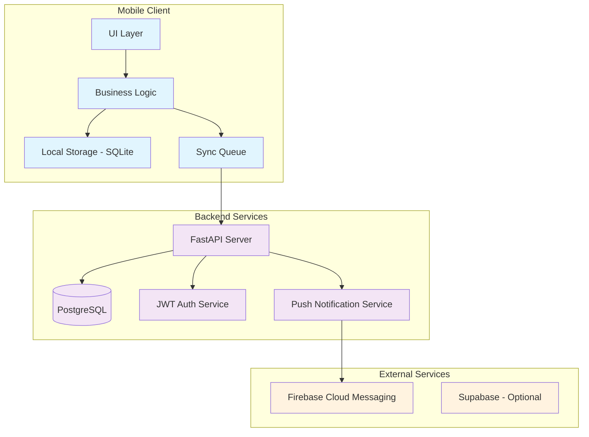
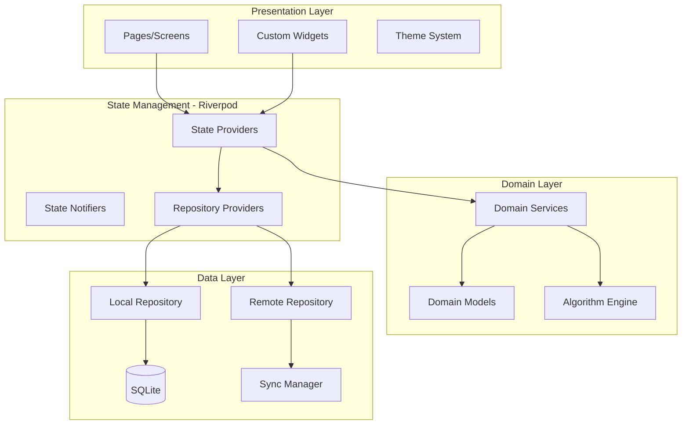
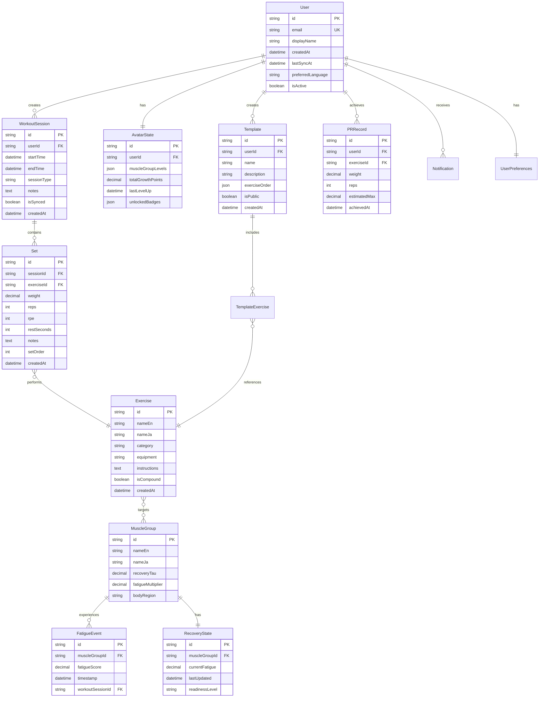
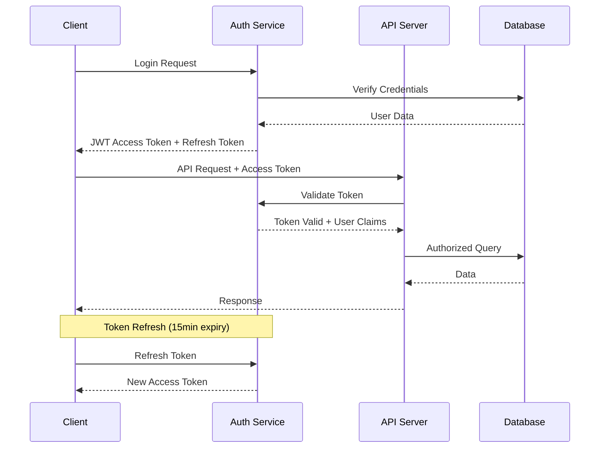

# CycleAvatar Design Document

## Overview

CycleAvatarは、科学的根拠に基づく疲労・回復モデルとゲーミフィケーション要素を組み合わせた、オフライン優先のモバイル筋トレアプリです。Flutter/React Nativeによるクロスプラットフォーム開発、FastAPI + PostgreSQLバックエンド、SQLiteローカルストレージによる堅牢なオフライン機能を提供します。

## Architecture

### システム全体アーキテクチャ



### クライアントアーキテクチャ

**フレームワーク選定: Flutter**

選定理由：
- **パフォーマンス**: ネイティブレベルの描画性能、60fps維持
- **オフライン機能**: SQLiteとの統合が優秀、複雑な同期ロジックに適している
- **UI一貫性**: Material Design 3対応、カスタムアニメーション実装が容易
- **開発効率**: Hot Reload、豊富なパッケージエコシステム
- **長期保守性**: Googleの長期サポート、企業採用実績



## Components and Interfaces

### 主要コンポーネント

#### 1. Fatigue & Recovery Engine

```dart
class FatigueEngine {
  // 疲労スコア計算
  double calculateFatigueScore({
    required double volume,      // セット数 × 回数 × 重量
    required double intensity,   // %1RM
    required int rpe,           // 主観的運動強度
    required MuscleGroup muscleGroup,
  });
  
  // 回復計算（指数減衰モデル）
  double calculateRecovery({
    required double initialFatigue,
    required Duration timeSinceWorkout,
    required MuscleGroup muscleGroup,
  });
  
  // 準備状態判定
  ReadinessLevel getReadinessLevel(double currentFatigue);
}
```

#### 2. Avatar Growth System

```dart
class AvatarSystem {
  // 成長判定
  bool shouldLevelUp({
    required WorkoutSession session,
    required ReadinessLevel preWorkoutReadiness,
    required bool achievedProgression,
  });
  
  // レベル計算
  int calculateNewLevel({
    required MuscleGroup muscleGroup,
    required int currentLevel,
    required double growthPoints,
  });
}
```

#### 3. Smart Plan Generator

```dart
class PlanGenerator {
  // 次回セッション提案
  WorkoutPlan generateNextSession({
    required List<ReadinessLevel> muscleGroupReadiness,
    required TrainingGoal goal,
    required List<WorkoutSession> recentSessions,
  });
  
  // デロード判定
  bool shouldDeload({
    required List<WorkoutSession> last4Weeks,
    required double fatigueThreshold,
  });
}
```

#### 4. Offline Sync Manager

```dart
class SyncManager {
  // 同期キュー管理
  Future<void> queueForSync(SyncableEntity entity);
  
  // バックグラウンド同期
  Future<SyncResult> performSync();
  
  // 競合解決（クライアント優先）
  Future<void> resolveConflicts(List<ConflictEntity> conflicts);
}
```

## Data Models

### エンティティ関係図



### 主要データ型定義

```dart
// 疲労・回復関連
enum ReadinessLevel { ready, warm, fatigued }
enum TrainingGoal { hypertrophy, strength, general }

// 筋群定数（回復時定数τ - 時間単位）
const Map<String, double> RECOVERY_TAU = {
  'chest': 48.0,
  'back': 72.0,
  'shoulders': 48.0,
  'biceps': 48.0,
  'triceps': 48.0,
  'quadriceps': 72.0,
  'hamstrings': 72.0,
  'glutes': 72.0,
  'calves': 48.0,
  'abs': 24.0,
};

// 疲労計算定数
const Map<String, double> FATIGUE_MULTIPLIERS = {
  'chest': 1.0,
  'back': 1.2,      // 大筋群のため高め
  'shoulders': 0.8,  // 小筋群のため低め
  'quadriceps': 1.3, // 最大筋群
  'hamstrings': 1.1,
  // ... 他の筋群
};
```

## Error Handling

### エラー分類と対応戦略

```dart
// エラー階層
abstract class AppError {
  final String message;
  final String code;
  final DateTime timestamp;
}

class NetworkError extends AppError {
  // オフライン時、同期失敗など
  // 対応: キューイング、リトライ、ユーザー通知
}

class ValidationError extends AppError {
  // 入力値検証エラー
  // 対応: 即座にUI反映、修正ガイダンス
}

class DataCorruptionError extends AppError {
  // ローカルDB破損、同期競合など
  // 対応: 自動修復、バックアップ復元、最終手段でリセット
}

class BusinessLogicError extends AppError {
  // 疲労計算エラー、アバター成長ロジックエラーなど
  // 対応: フォールバック値、ログ送信、段階的機能無効化
}
```

### エラー回復戦略

1. **ネットワークエラー**: 指数バックオフでリトライ、オフライン継続
2. **データ整合性エラー**: 自動修復 → バックアップ復元 → ユーザー選択
3. **計算エラー**: デフォルト値使用、機能一時無効化、開発者通知

## Testing Strategy

### テスト階層

```mermaid
pyramid TB
    subgraph "Testing Pyramid"
        E2E[E2E Tests<br/>10%]
        INTEGRATION[Integration Tests<br/>20%]
        UNIT[Unit Tests<br/>70%]
    end
    
    subgraph "Test Types"
        WIDGET[Widget Tests]
        GOLDEN[Golden Tests]
        PERFORMANCE[Performance Tests]
        OFFLINE[Offline Scenario Tests]
    end
```

### 重要テストケース

#### 1. 疲労・回復アルゴリズム
```dart
group('Fatigue Engine Tests', () {
  test('should calculate correct fatigue score for compound exercise', () {
    // Given: スクワット 100kg × 8回 × 3セット, RPE 8
    // When: 疲労スコア計算
    // Then: 期待値範囲内（例: 85-95）
  });
  
  test('should apply exponential decay for recovery', () {
    // Given: 初期疲労100, 48時間経過, 大腿四頭筋
    // When: 回復計算
    // Then: 約37%まで減衰（e^(-48/72) ≈ 0.37）
  });
});
```

#### 2. オフライン同期
```dart
group('Offline Sync Tests', () {
  test('should queue operations when offline', () {
    // Given: オフライン状態
    // When: セット記録
    // Then: ローカル保存 + 同期キューに追加
  });
  
  test('should resolve conflicts with client priority', () {
    // Given: サーバーとローカルで同じセットが異なる値
    // When: 同期実行
    // Then: ローカル値でサーバー上書き
  });
});
```

#### 3. アバター成長
```dart
group('Avatar Growth Tests', () {
  test('should level up when progression achieved in ready state', () {
    // Given: Ready状態, 前回より重量+2.5kg達成
    // When: セッション完了
    // Then: 対象筋群レベル+1
  });
  
  test('should apply cooldown when overtraining', () {
    // Given: Fatigued状態でトレーニング
    // When: 成長判定
    // Then: 成長ポイント50%減
  });
});
```

### パフォーマンステスト

- **ホーム画面表示**: < 500ms（ウォーム起動）
- **セット追加**: < 150ms
- **同期処理**: バックグラウンド、UI非ブロッキング
- **メモリ使用量**: < 100MB（通常使用時）

## アルゴリズム詳細

### 疲労・回復モデル

#### 疲労スコア計算

```
FatigueScore = Volume × IntensityFactor × RPEFactor × MuscleGroupMultiplier

where:
- Volume = Sets × Reps × Weight
- IntensityFactor = (RPE - 5) / 5  // RPE 6-10を0.2-1.0にマッピング
- RPEFactor = RPE / 10
- MuscleGroupMultiplier = 筋群別定数（上記参照）
```

#### 回復計算（指数減衰）

```
Recovery(t) = InitialFatigue × e^(-t/τ)

where:
- t = 経過時間（時間単位）
- τ = 筋群別回復時定数
- InitialFatigue = トレーニング直後の疲労スコア
```

#### 準備状態判定

```
ReadinessLevel = {
  Ready:    CurrentFatigue < 30
  Warm:     30 ≤ CurrentFatigue < 70
  Fatigued: CurrentFatigue ≥ 70
}
```

### 漸進判定アルゴリズム

```dart
bool isProgression({
  required Set currentSet,
  required List<Set> previousSets, // 同種目の直近2回
  required ReadinessLevel readiness,
}) {
  if (readiness != ReadinessLevel.ready) return false;
  
  // 重量漸進: +2.5kg以上 または 回数+1以上（同重量）
  final avgPreviousWeight = previousSets.map((s) => s.weight).average;
  final avgPreviousReps = previousSets.map((s) => s.reps).average;
  
  return (currentSet.weight > avgPreviousWeight + 2.5) ||
         (currentSet.weight == avgPreviousWeight && 
          currentSet.reps > avgPreviousReps);
}
```

### デロード判定

```dart
bool shouldDeload({
  required List<WorkoutSession> last4Weeks,
  required Map<MuscleGroup, double> currentFatigue,
}) {
  // 条件1: 4週間で総ボリューム20%以上増加
  final volumeIncrease = calculateVolumeIncrease(last4Weeks);
  
  // 条件2: 複数筋群が慢性的に高疲労
  final highFatigueGroups = currentFatigue.values
      .where((fatigue) => fatigue > 80)
      .length;
  
  return volumeIncrease > 0.20 && highFatigueGroups >= 3;
}
```

## セキュリティ設計

### 認証・認可



### データ保護

1. **転送時暗号化**: TLS 1.3, Certificate Pinning
2. **保存時暗号化**: 
   - ローカル: SQLite暗号化（SQLCipher）
   - サーバー: PostgreSQL TDE
3. **PII最小化**: 
   - 必須項目: email, displayName のみ
   - オプション: 年齢層、性別（統計目的）
   - 収集しない: 実名、住所、電話番号

### プライバシー設計

```dart
class PrivacyManager {
  // データエクスポート
  Future<Map<String, dynamic>> exportUserData(String userId);
  
  // データ削除（GDPR準拠）
  Future<void> deleteUserData(String userId, {
    bool keepAnonymizedStats = false,
  });
  
  // 同意管理
  Future<void> updateConsent(String userId, ConsentType type, bool granted);
}
```

## 国際化（i18n）設計

### 多言語対応アーキテクチャ

```
lib/
├── l10n/
│   ├── app_en.arb          # 英語リソース
│   ├── app_ja.arb          # 日本語リソース
│   └── app_localizations.dart
├── models/
│   └── exercise.dart       # 多言語対応モデル
└── services/
    └── localization_service.dart
```

### 種目・筋群の多言語化

```dart
class Exercise {
  final String id;
  final Map<String, String> names; // {'en': 'Squat', 'ja': 'スクワット'}
  final Map<String, String> instructions;
  
  String getLocalizedName(String locale) => 
      names[locale] ?? names['en'] ?? id;
}

class MuscleGroup {
  final String id;
  final Map<String, String> names; // {'en': 'Quadriceps', 'ja': '大腿四頭筋'}
  
  String getLocalizedName(String locale) => 
      names[locale] ?? names['en'] ?? id;
}
```

## 通知システム設計

### 通知タイプと配信ロジック

```dart
enum NotificationType {
  recoveryComplete,    // 筋群回復完了
  deloadRecommended,   // デロード推奨
  prAchieved,         // PR達成
  streakMilestone,    // 連続記録マイルストーン
  weeklyHighlight,    // 週次ハイライト
}

class NotificationService {
  // スマート通知スケジューリング
  Future<void> scheduleRecoveryNotification({
    required MuscleGroup muscleGroup,
    required Duration estimatedRecoveryTime,
    required UserPreferences preferences,
  });
  
  // 通知頻度制御（ユーザー疲れ防止）
  bool shouldSendNotification({
    required NotificationType type,
    required DateTime lastSent,
    required int userEngagement,
  });
}
```

### プッシュ通知設定

```dart
class NotificationPreferences {
  bool recoveryNotifications = true;
  bool prNotifications = true;
  bool weeklyHighlights = true;
  
  TimeOfDay quietHoursStart = TimeOfDay(hour: 22, minute: 0);
  TimeOfDay quietHoursEnd = TimeOfDay(hour: 7, minute: 0);
  
  Set<DayOfWeek> enabledDays = DayOfWeek.values.toSet();
  
  Map<MuscleGroup, bool> muscleGroupNotifications = {};
}
```

この設計文書では、CycleAvatarの技術的実装に必要な全ての要素を詳細に定義しました。次に、この設計に基づいて実装タスクリストを作成する準備が整いました。